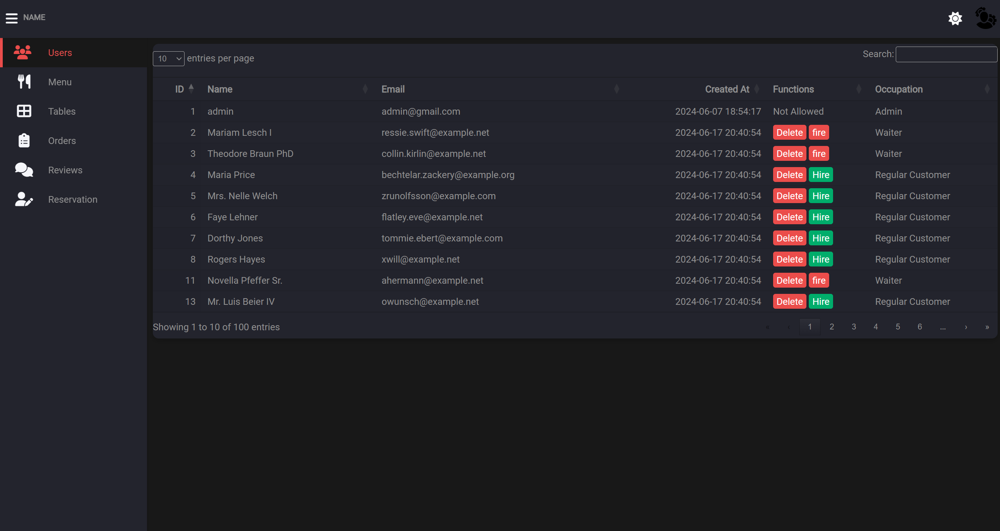
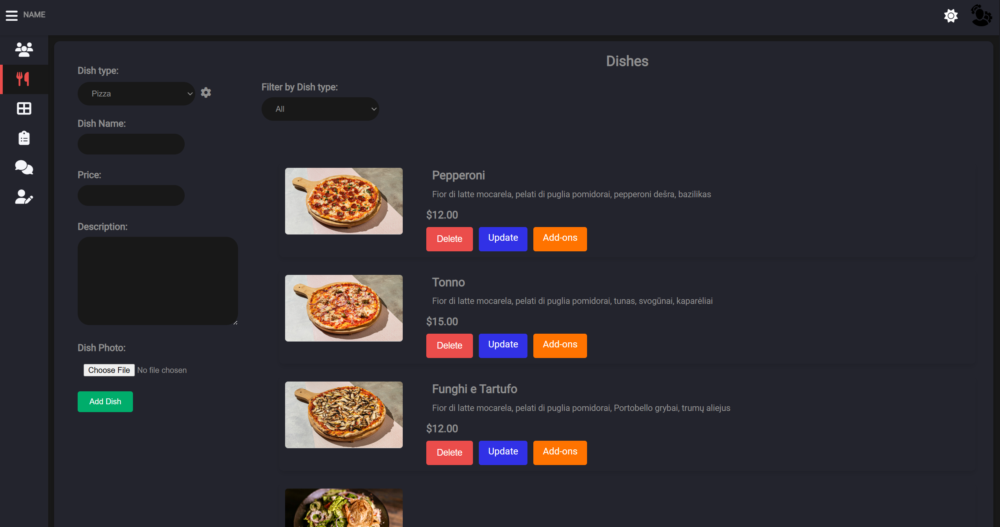
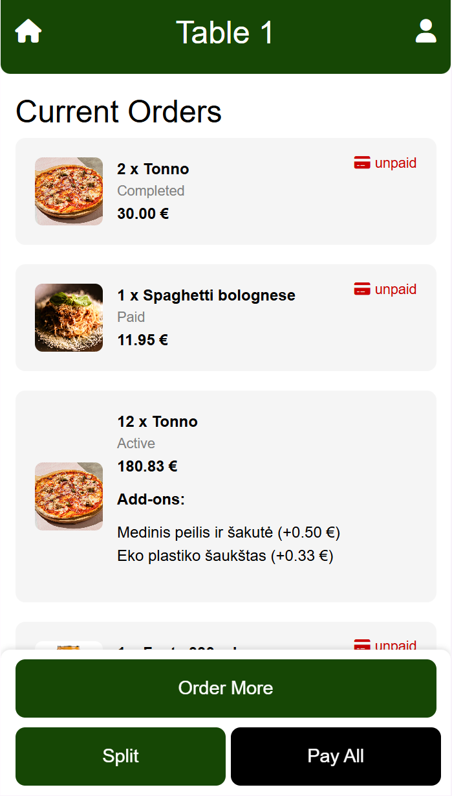
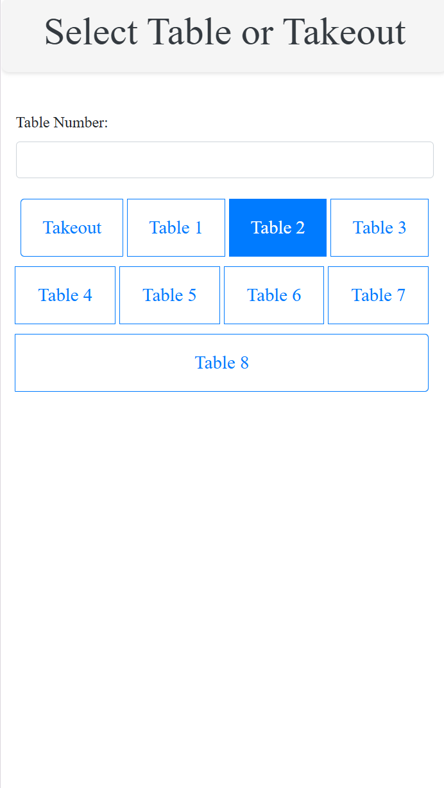

# Laravel Restaurant Management Web App

This is a Laravel-based restaurant management system designed to streamline operations for restaurant staff and improve the customer experience. The system provides functionalities for managing the menu, taking orders, processing payments, and more. It includes an intuitive admin panel, mobile-compatible interfaces for waitstaff and customers, and seamless integration with the payment gateway.

## Live Demo

You can access the live version of the application here: [http://193.219.91.104:15965/](http://193.219.91.104:15965/)

- **Admin Login**: 
  - Email: `admin@gmail.com`
  - Password: `12345678`

## Prerequisites

Before running the application, ensure that you have the following installed:

- **XAMPP**: Used to run Apache and MySQL servers locally.
- **Laravel**: PHP framework for building the web application.

## Installation Instructions

Follow the steps below to run this application locally:

### 1. Launch XAMPP

- Start the **Apache** and **MySQL** servers from the XAMPP Control Panel.

### 2. Create the Database

- Open **phpMyAdmin** (http://localhost/phpmyadmin/).
- Create a new database named `restaurant`.

### 3. Run Laravel Migrations and Seeders

- Open a terminal or command prompt.
- Navigate to your Laravel project directory.
- Run the following command to migrate the database:
  ```bash
  php artisan migrate
  ```
- Then, run the seeders to populate the database with initial data:
  ```bash
  php artisan db:seed
  ```

### 4. Start the Laravel Development Server

- In the terminal, run the following command to start the development server:
  ```bash
  php artisan serve
  ```

### 5. Access the Web App

- Open your web browser and go to [http://localhost:8000](http://localhost:8000) to access the app.

## Features

- **Admin Panel**: Manage menu items, orders, customer reviews, waitstaff, and reservations.
- **Mobile Access for Waitstaff**: Waitstaff can view and manage orders directly from their mobile devices.
- **QR Code Ordering**: Customers can scan QR codes placed on tables to access the menu, place orders, and pay bills.
- **Online Payment**: Integration with Stripe for secure payment processing.
- **Bill Splitting**: Customers can split bills between multiple users.

## Technologies Used

- **Backend**: PHP (Laravel)
- **Frontend**: HTML, CSS (Bootstrap), JavaScript
- **Database**: MySQL (via Laravel Eloquent ORM)
- **Payment Gateway**: Stripe
- **QR Code Generation**: `simple-qrcode` Laravel package

## Security Features

- **CSRF Protection**: Ensures security against cross-site request forgery.
- **Data Encryption**: Sensitive data like passwords are encrypted using Laravel's hashing functions.
- **Role-based Authentication**: Different access levels for admins, waitstaff, and customers.

## Development

To contribute to this project, clone the repository, install the necessary dependencies, and start building!

```bash
git clone https://github.com/Sasha18trt/restaurant.git
cd restaurant
composer install
npm install
php artisan key:generate
```
## Screenshots

### Admin Panel

The admin panel allows restaurant staff to manage menu items, orders, and waitstaff, ensuring smooth operations.

### Admin Menu View

An overview of the admin's menu management interface, where administrators can edit and organize menu items.

### Main Page

The landing page provides customers with a seamless way to explore the restaurant’s offerings.

### QR Code Scanning

Each table has a unique QR code that customers can scan to access the menu, place orders, and pay directly.

### Table View

A customer’s table view showing details of their order and payment options.

### Waiter View

A dedicated interface for waitstaff to manage and fulfill customer orders efficiently.
